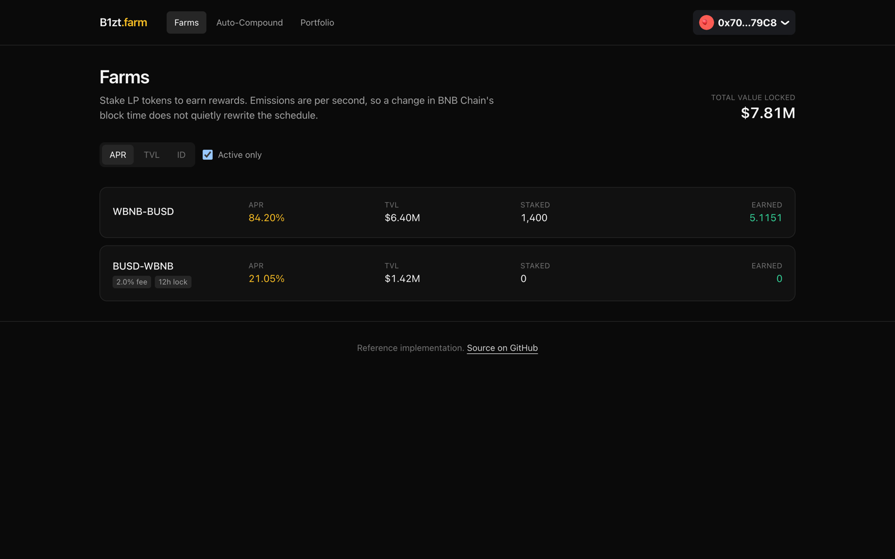
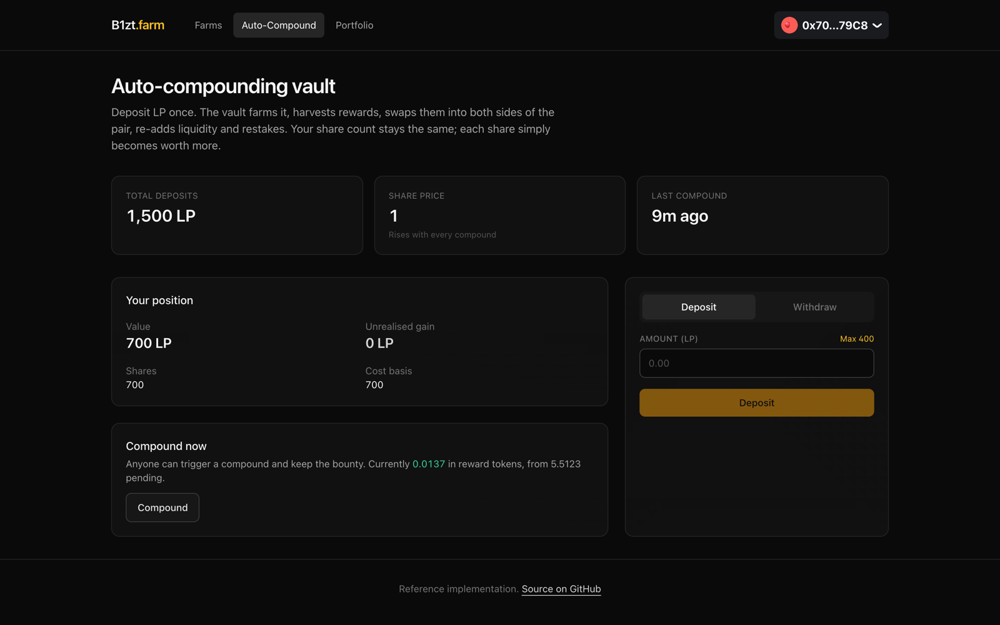
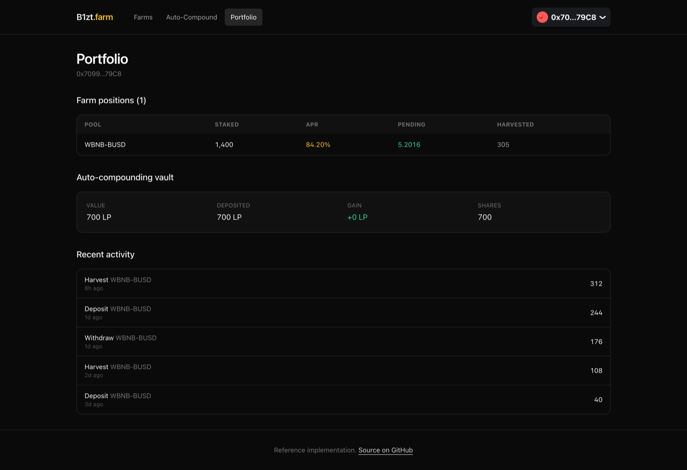

# DeFi Farm and Auto-Compounding Vault

Yield farming on BNB Chain: a MasterChef farm that pays rewards for staking LP tokens, and a vault
on top of it that harvests, swaps and re-stakes for you so you do not have to.

Solidity contracts, a TypeScript API with a keeper bot, and a Next.js frontend. The whole thing runs
on your laptop in about five minutes, with no testnet faucet and no API keys.


> **BEP-20 is ERC-20.** There is no separate standard to implement. What makes this a BNB Chain
> project is the ecosystem it integrates with: PancakeSwap for liquidity, Chainlink's BSC feeds for
> pricing, and deployment targets across BSC mainnet, testnet and opBNB.

---

## What you can do with it

**Farm LP tokens.** Rewards are emitted per second rather than per block, so a change in BNB Chain's
block time does not quietly rewrite the schedule. Each pool has its own weight, and can charge a
deposit fee or hold harvests for a lockup period.



**Deposit once and let the vault compound.** It harvests rewards, swaps them into both sides of the
pair through PancakeSwap, re-adds liquidity and stakes the result. Your share count never changes;
each share simply becomes worth more.



**Trigger a compound yourself and keep the bounty.** Anyone can call it, so the vault never depends
on one keeper staying alive. The keeper bot in `backend/src/keeper` does the same on a timer, and
only when the bounty is genuinely worth more than the gas.



---

## Run it yourself

You will need [Docker](https://docs.docker.com/get-docker/), [Node 20+](https://nodejs.org),
[pnpm](https://pnpm.io/installation) and
[Foundry](https://book.getfoundry.sh/getting-started/installation).

### 1. Start Postgres and a local chain

```bash
docker compose up -d
```

Postgres lands on port 5434 and an Anvil node on 8547. Anvil is a local chain: it mines on a timer,
hands out funded test accounts, and forgets everything when you stop it.

### 2. Deploy the whole stack

```bash
cd contracts
forge install

export RPC=http://localhost:8547
export PRIVATE_KEY=0xac0974bec39a17e36ba4a6b4d238ff944bacb478cbed5efcae784d7bf4f2ff80

forge script script/Demo.s.sol:Demo --rpc-url $RPC --broadcast --gas-estimate-multiplier 250
```

`Demo.s.sol` deploys the farm, the vault and the oracle, along with stand-ins for the PancakeSwap
router, the LP pair and the Chainlink feed. It then opens two pools and stakes into them from three
wallets, so the app has something to show.

Those stand-ins are the same ones the test suite uses: a constant-product router with PancakeSwap's
real 0.25% fee, so slippage and swap accounting behave the way they do in production. Only the
counterparty is local, and `test/ForkPancake.t.sol` is what covers the real router.

That key is Anvil's first test account, published in Foundry's own documentation and worthless on
any real network. Never put a key holding real funds into a shell variable.

The script prints every deployed address. Keep the output.

> **Want the real PancakeSwap instead?** Add `--fork-url <archive endpoint>` to the anvil command in
> `docker-compose.yml`, then deploy with `Deploy.s.sol` passing the real router and pair addresses.
> This needs an **archive** node: the public BSC dataseed endpoints prune state within a couple of
> hundred blocks, so a fork against them fails with `missing trie node` as soon as the chain head
> moves past your fork block.

### 3. Start the backend

```bash
cd ../backend
cp .env.example .env        # paste in the addresses from step 2
pnpm install
pnpm prisma db push         # create the tables
pnpm db:seed                # pool stats, positions and keeper history
pnpm dev
```

`pnpm db:seed` fills the tables the indexer would normally build from chain history, so the pool
list has TVL and APR rather than being correct and empty.

### 4. Start the frontend

```bash
cd ../frontend
cp .env.example .env.local  # paste in the NEXT_PUBLIC_ addresses from step 2
pnpm install
pnpm dev
```

Open <http://localhost:3000>. To connect a wallet, add the Anvil network to MetaMask (RPC
`http://localhost:8547`, chain id `31337`) and import the test key from step 2.

### If something does not work

| Symptom | Cause |
|---|---|
| Every page says "wrong network" | Your wallet is not on chain 31337. |
| TVL and APR read `$0.00` | You skipped `pnpm db:seed`, or the backend cannot reach Anvil. `curl localhost:4002/health` should return `{"status":"ok"}`. |
| Backend exits at startup | It validates its whole environment at boot and names the variable at fault. |
| `Demo.s.sol` fails out of gas | Keep `--gas-estimate-multiplier 250`. The vault's deposit path is deeper than a single estimate accounts for. |

---

## Layout

```
contracts/
  src/MasterChef.sol          Per-second emissions, deposit fees, harvest lockups
  src/AutoCompoundVault.sol   ERC-4626 vault that harvests and re-stakes
  src/PriceOracle.sol         Chainlink feeds with staleness checks
  src/RewardToken.sol         Capped, role-gated reward token
  script/Deploy.s.sol         Deployment against a real chain
  script/Demo.s.sol           Full local stack with demo state
  test/ForkPancake.t.sol      7 tests against live BSC
  test/                       73 further tests
backend/
  src/keeper/                 Compound bot with a profitability check
  src/pricing.ts              TVL and APR from oracle prices
  src/indexer/                Chain events into the database
  prisma/seed.ts              Sample data
frontend/                     Farms, vault and portfolio
```

```bash
cd contracts && forge test    # 73 tests
```

The fork tests need an archive endpoint:

```bash
cd contracts && forge test --match-path test/ForkPancake.t.sol --fork-url <archive endpoint>
```

---

## Decisions worth explaining

**The four classic MasterChef bugs are fixed, and a fifth was found here.** Most BSC farms are
copies of a copy and inherit the same defects: pools not updated before weight changes, deposit fees
credited as stake, reward debt computed against a stale accumulator, and `massUpdatePools` skipped on
`add`. All four are handled.

The fifth came out of a test in this repo. Once the reward token reached its cap, `updatePool`
reverted, and because every deposit and withdraw calls it, the entire farm bricked permanently.
Accrual is now clamped to what remains mintable, so the farm keeps working after emissions end.
`test_farmKeepsWorkingAfterCapIsReached` is that test.

**Slippage is bounded by a quote taken in the same transaction.** The vault asks the router what it
should receive, then requires at least that minus a bounded tolerance. The mock router can be told
to execute worse than it quotes, which is what makes the slippage test prove something: without
that, a mock's quote and fill agree exactly and the test passes no matter what the contract does.

**The oracle runs four checks on every read.** Answer greater than zero, round complete, answer no
older than the feed's heartbeat, and the round not stale. `getPrice` reverts on a bad answer;
`tryGetPrice` degrades. Contracts that call `latestAnswer` and nothing else are how oracle
liquidations happen.

**The keeper records every decision, not just the ones it acted on.** A compound that costs more gas
than the bounty pays should not happen, and the log is how you prove the keeper knew that. Skipped
runs appear alongside successful ones.

**Emergency withdraw always works.** It abandons pending rewards and returns the principal with no
call into the reward token at all, so a broken or paused reward token cannot trap deposits.

---

## A note on the toolchain

`evm_version` is set to `cancun`. BNB Chain enabled it in the Tycho hardfork and opBNB followed, and
OpenZeppelin v5 emits `MCOPY`, so an older target does not compile.

This code has not been audited. It is a reference implementation.

---

## License

MIT
