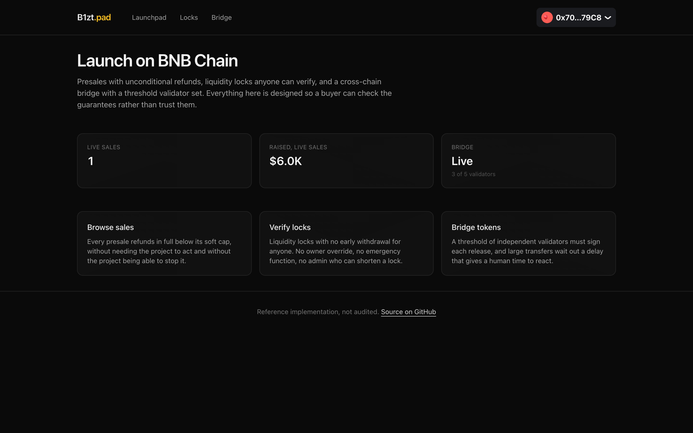
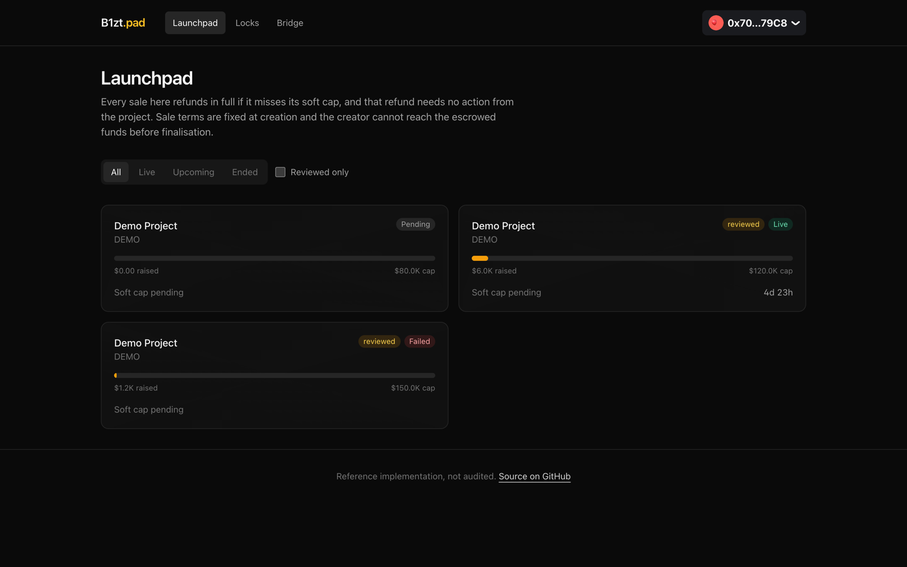
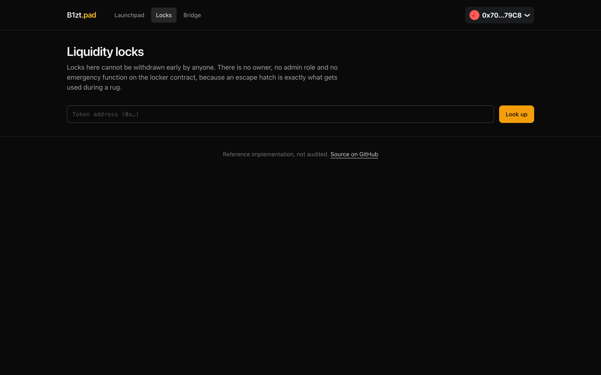

# Launchpad, Presale and Cross-Chain Bridge

A token launchpad for BNB Chain: presales where refunds are unconditional, a liquidity locker with
no escape hatch, and a bridge that only releases funds once a threshold of independent validators
has signed.

Solidity contracts, a TypeScript API with a bridge relayer, and a Next.js frontend. The whole thing
runs on your laptop in about five minutes, with no testnet faucet and no API keys.



---

## A note on this category

Presales and bridges are the two most abused contract types in crypto. Presales because the money
arrives before the product, bridges because they concentrate value behind code that has repeatedly
turned out to be wrong.

Both are built here around one principle: **a buyer should be able to verify the guarantees, not
trust them.** Where a guarantee cannot be enforced in code, this repo says so plainly rather than
implying safety it cannot deliver.

---

## What you can do with it

**Run a presale.** Contributions are priced in USD through Chainlink, so a sale can accept BNB and
stablecoins at once and still have a single hard cap. Tiers are a Merkle root, so an allowlist of
50,000 addresses costs one transaction to publish.



**Get refunded automatically if the sale misses its soft cap.** Not "the team will refund you":
there is no admin function that can touch escrowed funds before finalisation, and refunds below the
soft cap need no approval from anyone.

**Lock liquidity where nobody can pull it.** The locker has no owner at all, and no early withdrawal
in any form. A lock can be extended, transferred or split, and that is the entire surface. There is
no pause, no admin, and no upgrade path, because each of those is a way to take the liquidity back.



**Bridge tokens between chains.** Tokens are locked on the source chain and released on the
destination once a threshold of validators has signed. The relayer that carries the message cannot
alter it: every field is covered by those signatures.


---

## Run it yourself

You will need [Docker](https://docs.docker.com/get-docker/), [Node 20+](https://nodejs.org),
[pnpm](https://pnpm.io/installation) and
[Foundry](https://book.getfoundry.sh/getting-started/installation).

### 1. Start Postgres and a local chain

```bash
docker compose up -d
```

Postgres lands on port 5435 and an Anvil node on 8548.

### 2. Deploy the whole stack

```bash
cd contracts
forge install

export RPC=http://localhost:8548
export PRIVATE_KEY=0xac0974bec39a17e36ba4a6b4d238ff944bacb478cbed5efcae784d7bf4f2ff80

forge script script/Demo.s.sol:Demo --rpc-url $RPC --broadcast --gas-estimate-multiplier 250

# Push the chain past the third sale's end time so it settles as FAILED.
cast rpc evm_increaseTime 600 --rpc-url $RPC && cast rpc evm_mine --rpc-url $RPC
```

`Demo.s.sol` deploys the factory, the locker and the bridge with a five validator set, then creates
three presales: one live, one upcoming and tier-gated, and one that will close under its soft cap. It
also locks liquidity three times and contributes from two wallets.

The failed sale matters. It is the case worth looking at, because that is where refunds either work
or do not.

That key is Anvil's first test account, published in Foundry's own documentation and worthless on
any real network. Never put a key holding real funds into a shell variable.

### 3. Start the backend

```bash
cd ../backend
cp .env.example .env        # paste in the addresses from step 2
pnpm install
pnpm prisma db push         # create the tables
pnpm db:seed                # contributions, locks and bridge transfers
pnpm dev
```

For a single-machine demo, point both `SOURCE_*` and `DESTINATION_*` at the same Anvil and the same
bridge address. One chain plays both roles, which is enough to exercise the whole message path. A
real deployment uses two chains and two bridge contracts.

### 4. Start the frontend

```bash
cd ../frontend
cp .env.example .env.local  # paste in the NEXT_PUBLIC_ addresses from step 2
pnpm install
pnpm dev
```

Open <http://localhost:3000>. To connect a wallet, add the Anvil network to MetaMask (RPC
`http://localhost:8548`, chain id `31337`) and import the test key from step 2.

### If something does not work

| Symptom | Cause |
|---|---|
| Every page says "wrong network" | Your wallet is not on chain 31337. |
| The bridge page says it is disabled | `DESTINATION_BRIDGE_ADDRESS` is unset in `backend/.env`. |
| No presales listed | You skipped `pnpm db:seed`, or the addresses in `.env` do not match what the demo script printed. |
| Backend exits at startup | It validates its whole environment at boot and names the variable at fault. |

---

## Layout

```
contracts/
  src/Presale.sol             One sale. Status is a pure function of raise and clock
  src/PresaleFactory.sol      EIP-1167 clones, funded atomically at creation
  src/LiquidityLocker.sol     No owner, no early withdrawal
  src/TokenBridge.sol         Threshold signatures, daily caps, large-transfer delay
  src/ChainlinkPriceFeed.sol  USD pricing with staleness checks
  script/Demo.s.sol           Full local stack with demo state
  test/TokenBridge.t.sol      Organised by exploit class: Nomad, Wormhole, Ronin
  test/                       70 tests
backend/
  src/relayer/                OBSERVED to CONFIRMED to SIGNED to SUBMITTED to COMPLETED
  src/indexer/                Chain events into the database
  prisma/seed.ts              Sample data
frontend/                     Launchpad, locker and bridge
```

```bash
cd contracts && forge test    # 70 tests
```

---

## Decisions worth explaining

**A presale's status is a pure function of its raise and the clock.** There is no status field an
owner can set. Whether a sale is live, succeeded or failed is derived, so the contract cannot claim
one thing while its balance says another.

**There is no admin path to escrowed funds.** Not a restricted one: none. Before finalisation the
only ways money leaves a Presale are a contribution refund and a successful finalisation. This is
the single most important property in the contract and the one most presale contracts get wrong.

**The locker has no owner.** No pause, no admin, no upgrade path, no early withdrawal. Every one of
those is a way to take locked liquidity back, and a locker with any of them is not a lock, it is a
promise.

**Bridge signatures must arrive in strictly ascending signer order.** That is what makes duplicate
signature detection O(n) instead of O(n²), and duplicate signatures are exactly how a threshold gets
forged by one compromised key. The test file is organised by exploit class, with a test per real
bridge failure: Nomad's uninitialised root, Wormhole's unverified guardian set, Ronin's
majority-of-validators compromise.

**Large transfers wait out a delay before release.** An hour, on anything above the threshold. That
delay is the window in which a compromised validator set can be noticed and the bridge paused before
the money leaves. It is the only defence that works after the signature check has already been
defeated.

**The bridge's trust model is stated in the UI.** An externally-validated bridge is only as honest
as a majority of its validators, that assumption has failed before on bridges far larger than this
one, and the interface says so rather than showing a padlock icon.

---

## What is not here

The relayer signs with a single key in this demo. A real validator set runs independent operators on
independent infrastructure, which is the entire security assumption: five validators run by one team
is a multisig with extra steps.

This code has not been audited. It is a reference implementation.

---

## License

MIT
