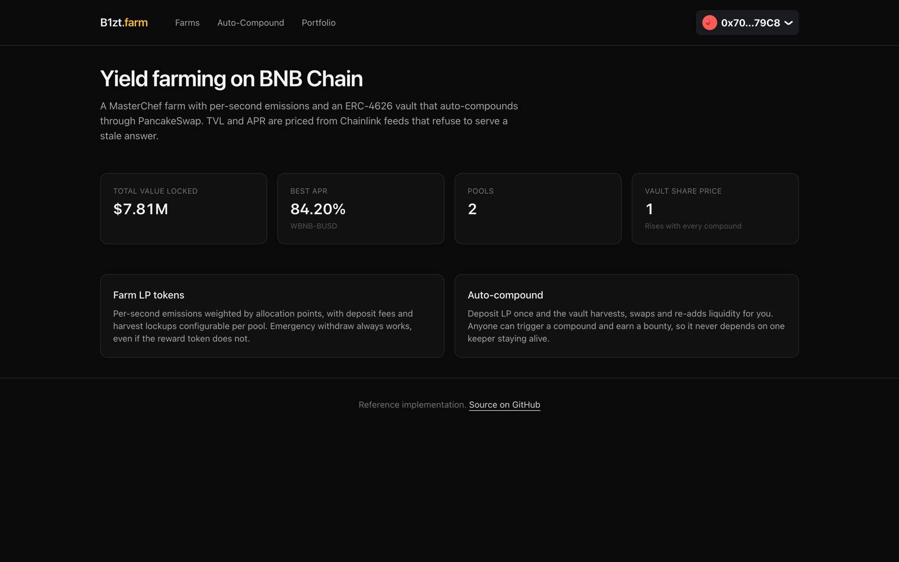
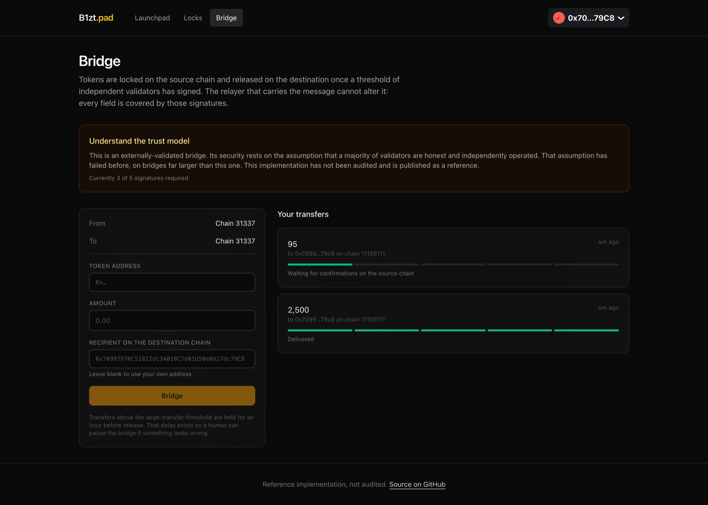

# BNB Chain Smart Contracts

Two full-stack BNB Chain projects, each with contracts, a backend with an off-chain worker, and a
frontend. Both run end to end on a laptop with no testnet faucet and no API keys.

Solidity 0.8.28 with Foundry. TypeScript with Fastify, Prisma and viem. Next.js with wagmi and
RainbowKit.

> **BEP-20 is ERC-20.** BNB Chain is EVM-compatible, so there is no separate token standard to
> implement and no separate language to learn. What makes these BNB Chain projects rather than
> Ethereum ones is the ecosystem they integrate with: PancakeSwap for liquidity, BSC's Chainlink
> feeds for pricing, the three second block time, and opBNB as a deployment target.

---

## [01 - DeFi Farm and Auto-Compounding Vault](01-defi-farm-vault)

A MasterChef farm with per-second emissions, and an ERC-4626 vault that harvests rewards, swaps them
through PancakeSwap and re-stakes the result.

[](01-defi-farm-vault)

The four classic MasterChef bugs are fixed, and a fifth was found by a test here: once the reward
token hit its cap, `updatePool` reverted and bricked every deposit and withdraw in the farm. 73 unit
tests plus 7 that run against live BSC.

---

## [02 - Launchpad, Presale and Cross-Chain Bridge](02-launchpad-bridge)

Presales with unconditional refunds, a liquidity locker with no owner at all, and a lock-and-mint
bridge with a threshold validator set.

[](02-launchpad-bridge)

A presale's status is a pure function of its raise and the clock, and there is no admin path to
escrowed funds. The bridge test file is organised by exploit class, with a test for each real
failure: Nomad, Wormhole, Ronin. 70 tests.

---

## Running either one

Each project has its own README with a step-by-step setup. The shape is the same:

```bash
cd 01-defi-farm-vault           # or 02-launchpad-bridge
docker compose up -d            # Postgres and a local Anvil chain
cd contracts && forge script script/Demo.s.sol:Demo --rpc-url $RPC --broadcast \
  --gas-estimate-multiplier 250
cd ../backend && pnpm install && pnpm prisma db push && pnpm db:seed && pnpm dev
cd ../frontend && pnpm install && pnpm dev
```

Each `Demo.s.sol` deploys the whole stack, including local stand-ins for PancakeSwap and Chainlink,
so nothing needs an archive node or a funded testnet account. The real integrations are covered by
fork tests.

The two projects use different ports, so you can run both at once.

---

None of this has been audited. It is written to be read.

## License

MIT
